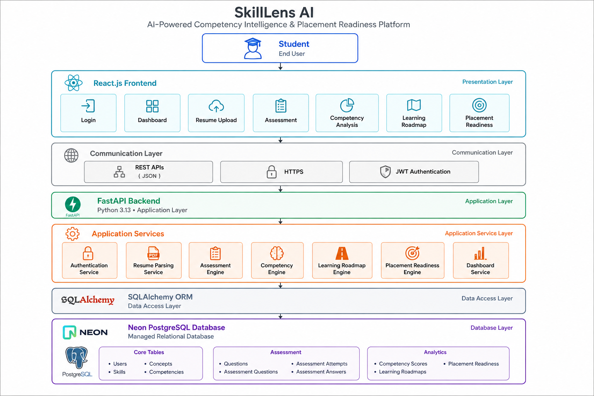
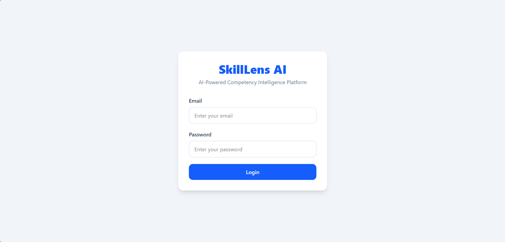

<div align="center">

# 🚀 SkillLens AI

### AI-Powered Competency Intelligence & Placement Readiness Platform

<p align="center">


</p>

A full-stack web application that helps students assess their technical competencies through resume analysis, competency-based assessments, personalized learning roadmaps, and placement readiness evaluation.

Built with **React • FastAPI • PostgreSQL (Neon) • SQLAlchemy • JWT Authentication**

</div>

---

# 📌 Table of Contents

- Project Overview
- Why SkillLens AI?
- Key Features
- System Workflow
- System Architecture

---

# 📖 Project Overview

SkillLens AI is a competency intelligence platform designed to help students prepare for technical placements by combining resume analysis, technical assessments, competency evaluation, and personalized learning recommendations.

Instead of providing only assessment scores, the platform helps students understand:

- Which technical skills they possess
- Their strongest competencies
- Concepts requiring improvement
- Personalized learning recommendations
- Overall placement readiness

The project brings together multiple modules into a single workflow, allowing students to evaluate their progress and identify areas that need further preparation.

---

# 🎯 Why SkillLens AI?

Many online assessment platforms stop after displaying a score.

SkillLens AI extends the learning process by connecting assessments with competency analysis and personalized recommendations.

The platform is designed to answer questions such as:

- Which concepts am I strong in?
- Which competencies need improvement?
- What should I learn next?
- Am I ready for placements?
- How can I improve my technical profile?

This makes SkillLens AI a learning-oriented platform rather than just an examination system.

---

# ✨ Key Features

## 🔐 Authentication

- Secure Login
- JWT Authentication
- Password Hashing using BCrypt
- Protected API Endpoints

---

## 📄 Resume Analysis

- Resume Upload (PDF)
- Resume Parsing
- Technical Skill Extraction
- Resume Readiness Score

---

## 📝 Assessment Engine

- Skill-Based Assessments
- Multiple Choice Questions
- Automatic Evaluation
- Score Calculation
- Assessment History

---

## 🧠 Competency Intelligence

- Competency Score Calculation
- Strength Identification
- Weakness Identification
- Concept-wise Performance Analysis

---

## 📚 Personalized Learning Roadmap

- Learning Recommendations
- Suggested Study Topics
- Practice Tasks
- Improvement Strategy

---

## 🎯 Placement Readiness

- Resume Score
- Assessment Score
- Competency Score
- Overall Readiness Score
- Readiness Level

---

## 📊 Dashboard

- Assessment Statistics
- Average Score
- Latest Assessment
- Top Competency
- Weakest Competency
- Competency Performance Visualization

---

# 🔄 Complete System Workflow

```text
                         Student Login
                               │
                               ▼
                        Dashboard Overview
                               │
                               ▼
                        Upload Resume (PDF)
                               │
                               ▼
                      Resume Parsing & Analysis
                               │
                               ▼
                      Technical Skill Extraction
                               │
                               ▼
                 Skill-Based Assessment Recommendation
                               │
                               ▼
                     Start Technical Assessment
                               │
                               ▼
                        Submit Assessment
                               │
                               ▼
                 Competency Score Calculation
                               │
                               ▼
              Personalized Learning Roadmap Generation
                               │
                               ▼
                 Placement Readiness Evaluation
                               │
                               ▼
                  Updated Dashboard & Insights
```

---

# 🏗️ System Architecture

The following diagram illustrates the layered architecture of **SkillLens AI**. The application follows a modular enterprise design where each layer has a dedicated responsibility, making the system scalable, maintainable, and easy to extend.

<p align="center">
    
</p>

---

### Architecture Overview

The application follows a **layered architecture** consisting of:

- **Presentation Layer** — React.js frontend for user interaction.
- **Communication Layer** — Secure REST APIs over HTTPS using JWT authentication.
- **Application Layer** — FastAPI backend that processes business requests.
- **Application Services** — Modular services responsible for authentication, resume parsing, assessments, competency analysis, learning roadmap generation, placement readiness, and dashboard analytics.
- **Data Access Layer** — SQLAlchemy ORM for database abstraction.
- **Database Layer** — Neon PostgreSQL storing users, assessments, competency scores, roadmaps, and placement readiness data.

---

### System Flow

```text
                     Student
                        │
                        ▼
              React.js Frontend
                        │
             REST APIs (HTTPS + JWT)
                        │
                        ▼
               FastAPI Backend
                        │
        ┌───────────────┼────────────────┐
        │               │                │
 Authentication   Assessment Engine   Resume Parsing
        │               │                │
 Competency Engine   Roadmap Engine   Dashboard Service
                        │
                        ▼
                 SQLAlchemy ORM
                        │
                        ▼
            Neon PostgreSQL Database
```
---
# 💻 Technology Stack

| Category | Technologies |
|----------|--------------|
| **Frontend** | React.js, Axios, React Router, Tailwind CSS |
| **Backend** | FastAPI, SQLAlchemy, Pydantic |
| **Database** | PostgreSQL (Neon) |
| **Authentication** | JWT, BCrypt Password Hashing |
| **Development Tools** | Git, GitHub, Postman, VS Code |
| **Programming Language** | Python 3.13, JavaScript (ES6+) |

---

# 📂 Project Structure

```text
skilllens-ai/
│
├── backend/
│   │
│   ├── app/
│   │   ├── core/
│   │   │   ├── config.py
│   │   │   └── security.py
│   │   │
│   │   ├── models/
│   │   ├── routes/
│   │   ├── schemas/
│   │   ├── services/
│   │   ├── utils/
│   │   ├── dependencies.py
│   │   └── main.py
│   │
│   ├── datasets/
│   ├── scripts/
│   ├── requirements.txt
│   └── .env.example
│
├── frontend/
│   │
│   ├── public/
│   │
│   ├── src/
│   │   ├── components/
│   │   ├── context/
│   │   ├── layouts/
│   │   ├── pages/
│   │   ├── services/
│   │   ├── assets/
│   │   ├── App.jsx
│   │   └── main.jsx
│   │
│   ├── package.json
│   └── vite.config.js
│
├── docs/
│
├── README.md
│
└── .gitignore
```

---

# 🗄 Database Design

The application uses **PostgreSQL** hosted on **Neon**.

## Main Tables

| Table | Description |
|--------|-------------|
| Users | Stores user information and authentication details |
| Skills | Technical skills supported by the platform |
| Concepts | Concepts belonging to each skill |
| Competencies | Competency categories used for evaluation |
| Questions | Assessment question bank |
| Assessment Questions | Mapping between assessments and questions |
| Assessment Attempts | Student assessment sessions |
| Assessment Answers | User answers and evaluation |
| Competency Scores | Generated competency results |
| Roadmaps | Personalized learning roadmap |
| Placement Readiness | Final placement readiness evaluation |

---

# ⚙ Backend Architecture

The backend follows a layered architecture.

```text
Routes
   │
   ▼
Services
   │
   ▼
Models
   │
   ▼
Database
```

### Routes

Responsible for:

- Receiving API requests
- Authentication
- Validation
- Returning API responses

---

### Services

Responsible for business logic such as:

- Resume Analysis
- Assessment Processing
- Competency Calculation
- Roadmap Generation
- Placement Readiness Calculation

---

### Models

SQLAlchemy ORM models representing database tables.

---

### Schemas

Pydantic schemas used for:

- Request validation
- Response serialization
- API documentation

---

# 🎨 Frontend Architecture

The frontend follows a component-based architecture.

```text
Pages
   │
   ▼
Components
   │
   ▼
Services
   │
   ▼
FastAPI APIs
```

The frontend communicates with the backend through REST APIs using Axios.

---

# 🔌 API Modules

## Authentication

- Login
- JWT Authentication

---

## Resume

- Upload Resume
- Resume Analysis

---

## Assessment

- Get Assessments
- Start Assessment
- Submit Answer
- Submit Assessment
- View Assessment Result

---

## Competency

- Latest Competency Scores
- Competency Analytics

---

## Learning Roadmap

- Latest Roadmap
- Personalized Recommendations

---

## Placement Readiness

- Generate Placement Readiness
- Latest Placement Readiness

---

## Dashboard

- Dashboard Summary
- Performance Overview
- Statistics
# ⚙ Installation Guide

## Prerequisites

Before running the project, ensure you have installed:

- Python 3.13+
- Node.js 20+
- PostgreSQL (or Neon Database)
- Git

---

## 1️⃣ Clone the Repository

```bash
git clone https://github.com/Yusuf-Shafiq-Raja/skilllens-ai.git

cd skilllens-ai
```

---

# 🖥 Backend Setup

Navigate to the backend folder.

```bash
cd backend
```

Create a virtual environment.

```bash
python -m venv venv
```

Activate the environment.

### Windows

```bash
venv\Scripts\activate
```

### Linux / macOS

```bash
source venv/bin/activate
```

Install the required packages.

```bash
pip install -r requirements.txt
```

---

## Environment Variables

Create a `.env` file inside the backend folder.

```env
DATABASE_URL=your_neon_database_url
SECRET_KEY=your_secret_key
ALGORITHM=HS256
ACCESS_TOKEN_EXPIRE_MINUTES=60
```

---

## Run Backend

```bash
uvicorn app.main:app --reload
```

Backend runs at

```
http://127.0.0.1:8000
```

Swagger Documentation

```
http://127.0.0.1:8000/docs
```

---

# 🌐 Frontend Setup

Navigate to the frontend folder.

```bash
cd frontend
```

Install dependencies.

```bash
npm install
```

Run the development server.

```bash
npm run dev
```

Frontend runs at

```
http://localhost:5173
```

---

# 📸 Screenshots

## 🔐 Login

<p align="center">

</p>

---

## 📊 Dashboard

<p align="center">

</p>

---

## 📈 Dashboard Analytics

<p align="center">

</p>

---

## 📄 Resume Upload

<p align="center">

</p>

---

## 📝 Assessment

<p align="center">

</p>

---

## 🧠 Competency Analysis

<p align="center">

</p>

---

## 📚 Learning Roadmap

<p align="center">

</p>

---

## 🎯 Placement Readiness

<p align="center">

</p>

# 🌍 Deployment

The project is designed to be deployed using the following services.

| Service | Platform |
|----------|----------|
| Frontend | Vercel |
| Backend | Render |
| Database | Neon PostgreSQL |

---

## Live Demo

### Frontend

Coming Soon

### Backend API

Coming Soon

---

# 🧪 Testing Checklist

The following workflow has been tested.

- Login
- Resume Upload
- Resume Parsing
- Skill Extraction
- Assessment Recommendation
- Start Assessment
- Submit Assessment
- Competency Score Generation
- Learning Roadmap Generation
- Placement Readiness Generation
- Dashboard Statistics

---

# 📈 Project Statistics

### Backend

- FastAPI REST APIs
- SQLAlchemy ORM
- JWT Authentication
- PostgreSQL Integration

### Frontend

- React Components
- Responsive Layout
- Dashboard
- Authentication
- API Integration

### Database

- 10+ Database Tables
- Competency Mapping
- Assessment Engine
- Placement Readiness Engine

---

# 🤝 Contributing

Contributions are welcome.

If you would like to improve the project:

1. Fork the repository.
2. Create a feature branch.
3. Commit your changes.
4. Push the branch.
5. Open a Pull Request.

---

# ❓ Frequently Asked Questions

### Does SkillLens AI use AI?

The current implementation uses rule-based competency evaluation and intelligent scoring to generate personalized learning roadmaps and placement readiness insights. The architecture is designed to support future integration of advanced AI or machine learning models.

---

### Can additional skills be added?

Yes.

The system is modular. New skills, concepts, competencies, and assessment questions can be added through the database without major code changes.

---

### Can this project be extended?

Yes.

The project is structured to support additional assessment types, analytics, and recommendation features in future versions.
---

# 🚀 Future Roadmap

The current version of SkillLens AI establishes a strong foundation for competency-based placement preparation. Future versions aim to enhance the platform with additional intelligent features.

### Planned Enhancements

- 🤖 AI-powered Interview Simulator
- 💻 Coding Assessment Module
- 📊 Advanced Performance Analytics
- 📄 Resume Improvement Suggestions
- 🎯 Company-specific Assessment Tracks
- 📧 Email Notifications
- 🏆 Student Leaderboard
- 📱 Mobile Responsive Enhancements
- 🌐 Multi-language Support
- ☁ Cloud Deployment & CI/CD Pipeline

---

# 📚 What I Learned

Building SkillLens AI strengthened my understanding of full-stack software engineering and backend system design.

### Backend

- Designing REST APIs using FastAPI
- SQLAlchemy ORM and relational database design
- JWT Authentication & Authorization
- Layered architecture (Routes → Services → Models)
- Pydantic schema validation
- Database seeding
- Error handling
- API integration

### Database

- PostgreSQL
- Foreign Key Relationships
- Database Normalization
- Assessment Data Modeling
- Competency Mapping
- Query Optimization

### Frontend

- React Component Architecture
- React Router
- Axios API Integration
- State Management
- Dashboard Design
- Responsive UI

### Software Engineering

- Project Planning
- Modular Architecture
- Git Version Control
- Code Refactoring
- Documentation
- Clean Code Practices

---

# 📈 Project Highlights

- ✅ Full-Stack Application
- ✅ JWT Authentication
- ✅ Resume Parsing
- ✅ Skill Extraction
- ✅ Assessment Engine
- ✅ Competency Intelligence
- ✅ Learning Roadmap
- ✅ Placement Readiness Engine
- ✅ Dashboard Analytics
- ✅ PostgreSQL Database
- ✅ FastAPI REST APIs
- ✅ React Frontend

---

# 🎯 Key Learning Outcome

SkillLens AI was built to explore how assessment data can be transformed into meaningful learning insights.

Instead of displaying only marks, the platform connects resume analysis, technical assessments, competency evaluation, personalized learning roadmaps, and placement readiness into a single workflow that helps students understand where they stand and what to improve next.

---

# 🙏 Acknowledgements

This project was developed as a personal portfolio project to strengthen practical knowledge in:

- Full Stack Development
- Backend API Development
- Database Design
- Competency-based Assessment Systems
- Software Architecture

Special thanks to the open-source community and the documentation of FastAPI, React, SQLAlchemy, PostgreSQL, and Neon for providing excellent learning resources.

---

# 👨‍💻 Author

## Yusuf Shafiq Raja

**B.Tech Information Technology**

SRM Institute of Science and Technology

### Connect with me

- GitHub: https://github.com/Yusuf-Shafiq-Raja
- LinkedIn: https://www.linkedin.com/in/yusuf-shafiq-raja-s-6a31b523a/

---

# 📜 License

This project is released for educational and portfolio purposes.

You are welcome to study, learn from, and build upon the ideas presented here. Please provide appropriate credit if significant portions of the work are reused.

---

<div align="center">

## ⭐ If you found this project interesting, consider giving it a star!

Thank you for visiting the repository.

Made with ❤️ using React, FastAPI and PostgreSQL.

</div>
